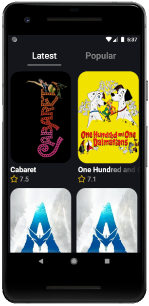
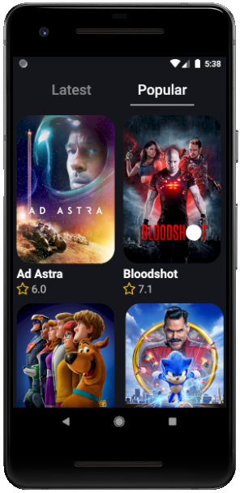

## MoviesApp-TMDB
  a simple app that shows movies (sorted by latest or popular) and a brief details about them using TMDB API.
  using mutable live data to observe the data from its repository and implementing the gitflow workflow.
  
# libraries
  * recycler_view
  * jason
  * retrofit
  * picasso
  * rounded_image
  * cardView
  * umano
  * ViewModel
  * LiveData
  
  
  
  
  
  
